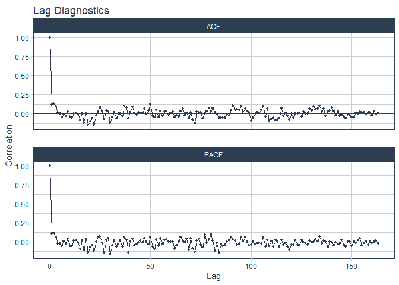
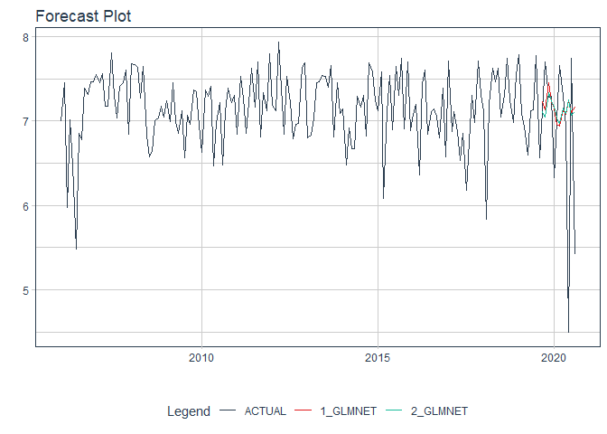

Untitled
================

``` r
root <- is_rstudio_project
data_tbl <- read_csv(root$find_file("data.csv"))
horizon <- 12
```

``` r
data_tbl %>% 
    plot_time_series(date, sala, .smooth = FALSE, .interactive = FALSE)
```


### Preprocessing and time series signature

``` r
data_prep_tbl <- data_tbl %>% 
    mutate(sala_trans = log(sala)) %>% 
    select(-sala)

data_prep_signature_tbl <- data_prep_tbl %>% 
    tk_augment_timeseries_signature() %>% 
    select(-contains(".iso"), -contains(".xts"), -contains("hour"), -contains("minute"), -diff,
           -contains("second"), -contains("am.pm"), -contains("week"), -contains("mday"), -contains("day"))
```

### Trend

``` r
data_prep_signature_tbl %>% 
    head(-horizon) %>% 
    plot_time_series_regression(
        date,
        .formula = sala_trans ~ index.num,
        .interactive = FALSE
    )
```


``` r
data_prep_signature_tbl %>% 
    head(-horizon) %>%
    plot_time_series_regression(
        date,
        .formula = sala_trans ~ splines::ns(index.num, df = 4),
        .interactive = FALSE
    )
```


## Seasonal features

### Monthly seasonality

``` r
data_prep_signature_tbl %>% 
    head(-horizon) %>% 
    plot_time_series_regression(
        date,
        .formula = sala_trans ~ month.lbl,
        .interactive = FALSE
    )
```


### Quarterly seasonality

``` r
data_prep_signature_tbl %>% 
    head(-horizon) %>% 
    plot_time_series_regression(
        date,
        .formula = sala_trans ~ as.factor(quarter),
        .interactive = FALSE
    )
```


### Monthly seasonality and trend

``` r
data_prep_signature_tbl %>% 
    head(-horizon) %>% 
    plot_time_series_regression(
        date,
        .formula = sala_trans ~ splines::ns(index.num, df = 4) + month.lbl +  as.factor(quarter),
        .show_summary = TRUE,
        .interactive = FALSE
    )
```

    ## 
    ## Call:
    ## stats::lm(formula = .formula, data = .data)
    ## 
    ## Residuals:
    ##      Min       1Q   Median       3Q      Max 
    ## -1.55201 -0.22677  0.03507  0.31376  0.80267 
    ## 
    ## Coefficients: (3 not defined because of singularities)
    ##                                 Estimate Std. Error t value Pr(>|t|)    
    ## (Intercept)                      7.06920    0.12844  55.040   <2e-16 ***
    ## splines::ns(index.num, df = 4)1  0.22429    0.16173   1.387    0.168    
    ## splines::ns(index.num, df = 4)2 -0.07650    0.16148  -0.474    0.636    
    ## splines::ns(index.num, df = 4)3  0.14921    0.32755   0.456    0.649    
    ## splines::ns(index.num, df = 4)4  0.10091    0.15220   0.663    0.508    
    ## month.lbl.L                      0.16349    0.11338   1.442    0.151    
    ## month.lbl.Q                      0.18458    0.11244   1.642    0.103    
    ## month.lbl.C                     -0.06461    0.11271  -0.573    0.567    
    ## month.lbl^4                     -0.06627    0.11262  -0.588    0.557    
    ## month.lbl^5                     -0.16004    0.11242  -1.424    0.157    
    ## month.lbl^6                     -0.05480    0.11266  -0.486    0.627    
    ## month.lbl^7                     -0.02450    0.11236  -0.218    0.828    
    ## month.lbl^8                     -0.06014    0.11236  -0.535    0.593    
    ## month.lbl^9                     -0.05404    0.11249  -0.480    0.632    
    ## month.lbl^10                    -0.12928    0.11182  -1.156    0.249    
    ## month.lbl^11                    -0.02825    0.11110  -0.254    0.800    
    ## as.factor(quarter)2                   NA         NA      NA       NA    
    ## as.factor(quarter)3                   NA         NA      NA       NA    
    ## as.factor(quarter)4                   NA         NA      NA       NA    
    ## ---
    ## Signif. codes:  0 '***' 0.001 '**' 0.01 '*' 0.05 '.' 0.1 ' ' 1
    ## 
    ## Residual standard error: 0.415 on 148 degrees of freedom
    ## Multiple R-squared:  0.07316,    Adjusted R-squared:  -0.02077 
    ## F-statistic: 0.7789 on 15 and 148 DF,  p-value: 0.6993


## Features - Non-time based

``` r
model_formula <- as.formula(
    sala_trans ~ splines::ns(index.num, df = 4) + month.lbl + .
)
```

### Fourier series

``` r
data_prep_signature_tbl %>% 
    head(-horizon) %>% 
    plot_acf_diagnostics(date, sala_trans,
                         .interactive = FALSE)
```



``` r
data_prep_fourier_tbl <- data_prep_signature_tbl %>% 
    tk_augment_fourier(
        .date    = date,
        .periods = c(2, 19, 25, 30),
        .K       = 5
    )

data_prep_fourier_tbl %>% 
    head(-horizon) %>% 
    # filter(date >= "2007-01-01") %>% 
    plot_time_series_regression(
        date,
        .formula = model_formula,
        .show_summary = TRUE,
        .interactive = FALSE
    )
```

    ## 
    ## Call:
    ## stats::lm(formula = .formula, data = .data)
    ## 
    ## Residuals:
    ##     Min      1Q  Median      3Q     Max 
    ## -0.8214 -0.2008  0.0110  0.1986  0.7034 
    ## 
    ## Coefficients: (5 not defined because of singularities)
    ##                                   Estimate Std. Error t value Pr(>|t|)   
    ## (Intercept)                     -1.578e+05  1.431e+05  -1.103  0.27237   
    ## splines::ns(index.num, df = 4)1 -5.343e+02  4.843e+02  -1.103  0.27239   
    ## splines::ns(index.num, df = 4)2 -7.265e+02  6.583e+02  -1.104  0.27220   
    ## splines::ns(index.num, df = 4)3 -1.206e+03  1.093e+03  -1.104  0.27220   
    ## splines::ns(index.num, df = 4)4 -9.183e+02  8.324e+02  -1.103  0.27239   
    ## month.lbl.L                      7.853e+01  7.108e+01   1.105  0.27168   
    ## month.lbl.Q                      5.771e-01  2.928e-01   1.971  0.05130 . 
    ## month.lbl.C                     -3.826e-01  2.159e-01  -1.772  0.07926 . 
    ## month.lbl^4                     -3.263e-02  1.609e-01  -0.203  0.83968   
    ## month.lbl^5                      1.227e-01  1.590e-01   0.772  0.44177   
    ## month.lbl^6                     -2.601e-01  1.724e-01  -1.508  0.13439   
    ## month.lbl^7                      5.477e-02  1.562e-01   0.351  0.72655   
    ## month.lbl^8                     -2.171e-01  1.937e-01  -1.121  0.26490   
    ## month.lbl^9                     -2.754e-02  1.032e-01  -0.267  0.79014   
    ## month.lbl^10                    -2.443e-01  1.451e-01  -1.684  0.09519 . 
    ## month.lbl^11                     1.213e-01  1.327e-01   0.914  0.36300   
    ## date                                    NA         NA      NA       NA   
    ## index.num                               NA         NA      NA       NA   
    ## year                             7.871e+01  7.134e+01   1.103  0.27235   
    ## half                                    NA         NA      NA       NA   
    ## quarter                                 NA         NA      NA       NA   
    ## month                                   NA         NA      NA       NA   
    ## date_sin2_K1                    -5.067e-02  4.323e-02  -1.172  0.24380   
    ## date_cos2_K1                     4.285e-02  4.181e-02   1.025  0.30783   
    ## date_sin2_K2                    -4.136e-02  5.153e-02  -0.803  0.42403   
    ## date_cos2_K2                    -3.265e-02  6.403e-02  -0.510  0.61115   
    ## date_sin2_K3                    -7.620e-02  4.212e-02  -1.809  0.07326 . 
    ## date_cos2_K3                    -6.079e-03  4.126e-02  -0.147  0.88315   
    ## date_sin2_K4                    -1.808e-01  8.272e-02  -2.185  0.03104 * 
    ## date_cos2_K4                    -2.352e-01  9.635e-02  -2.441  0.01628 * 
    ## date_sin2_K5                    -2.703e-03  4.351e-02  -0.062  0.95059   
    ## date_cos2_K5                     9.492e-02  4.115e-02   2.306  0.02301 * 
    ## date_sin19_K1                   -3.246e-02  4.303e-02  -0.755  0.45221   
    ## date_cos19_K1                    8.941e-02  4.537e-02   1.971  0.05131 . 
    ## date_sin19_K2                    4.271e-02  4.324e-02   0.988  0.32548   
    ## date_cos19_K2                   -8.710e-02  4.427e-02  -1.967  0.05171 . 
    ## date_sin19_K3                   -1.096e-01  9.260e-02  -1.184  0.23903   
    ## date_cos19_K3                   -7.813e-02  9.226e-02  -0.847  0.39901   
    ## date_sin19_K4                   -5.205e-02  4.272e-02  -1.218  0.22571   
    ## date_cos19_K4                   -4.574e-03  4.229e-02  -0.108  0.91406   
    ## date_sin19_K5                   -4.153e-02  4.258e-02  -0.975  0.33170   
    ## date_cos19_K5                   -2.138e-02  4.255e-02  -0.502  0.61635   
    ## date_sin25_K1                    8.401e-02  7.332e-02   1.146  0.25442   
    ## date_cos25_K1                   -1.551e-01  8.370e-02  -1.853  0.06661 . 
    ## date_sin25_K2                   -7.644e-02  4.403e-02  -1.736  0.08547 . 
    ## date_cos25_K2                    1.111e-01  4.385e-02   2.533  0.01277 * 
    ## date_sin25_K3                    4.958e-03  4.358e-02   0.114  0.90964   
    ## date_cos25_K3                   -3.136e-02  4.338e-02  -0.723  0.47139   
    ## date_sin25_K4                    1.104e-01  9.227e-02   1.196  0.23418   
    ## date_cos25_K4                    9.548e-02  9.202e-02   1.038  0.30178   
    ## date_sin25_K5                   -3.455e-02  4.255e-02  -0.812  0.41855   
    ## date_cos25_K5                   -5.410e-03  4.267e-02  -0.127  0.89936   
    ## date_sin30_K1                   -5.750e-03  6.502e-02  -0.088  0.92970   
    ## date_cos30_K1                    2.110e-01  6.704e-02   3.148  0.00213 **
    ## date_sin30_K2                    2.899e-02  4.357e-02   0.665  0.50724   
    ## date_cos30_K2                    7.830e-02  4.284e-02   1.828  0.07037 . 
    ## date_sin30_K3                    2.017e-02  4.361e-02   0.463  0.64463   
    ## date_cos30_K3                   -9.882e-03  4.340e-02  -0.228  0.82031   
    ## date_sin30_K4                    4.596e-02  4.310e-02   1.066  0.28864   
    ## date_cos30_K4                    5.022e-02  4.308e-02   1.166  0.24634   
    ## date_sin30_K5                    3.259e-02  6.691e-02   0.487  0.62719   
    ## date_cos30_K5                    1.585e-01  6.831e-02   2.321  0.02220 * 
    ## ---
    ## Signif. codes:  0 '***' 0.001 '**' 0.01 '*' 0.05 '.' 0.1 ' ' 1
    ## 
    ## Residual standard error: 0.3747 on 107 degrees of freedom
    ## Multiple R-squared:  0.4536, Adjusted R-squared:  0.1676 
    ## F-statistic: 1.586 on 56 and 107 DF,  p-value: 0.02087


### Lags

Doesn’t add much when compared to above (note that I have to filter date
\>= “2007-01-01” above to make these two comparable).

``` r
data_prep_lag_tbl <- data_prep_fourier_tbl %>% 
    tk_augment_lags(sala_trans, .lags = 12) %>% 
    drop_na()

data_prep_lag_tbl %>% 
    head(-horizon) %>% 
    plot_time_series_regression(
        date,
        .formula = model_formula,
        .show_summary = TRUE,
        .interactive = FALSE
    )
```

    ## 
    ## Call:
    ## stats::lm(formula = .formula, data = .data)
    ## 
    ## Residuals:
    ##      Min       1Q   Median       3Q      Max 
    ## -0.81961 -0.18363 -0.00143  0.18636  0.62620 
    ## 
    ## Coefficients: (5 not defined because of singularities)
    ##                                   Estimate Std. Error t value Pr(>|t|)  
    ## (Intercept)                     -1.486e+05  1.581e+05  -0.940   0.3496  
    ## splines::ns(index.num, df = 4)1 -4.656e+02  4.954e+02  -0.940   0.3497  
    ## splines::ns(index.num, df = 4)2 -6.333e+02  6.734e+02  -0.940   0.3494  
    ## splines::ns(index.num, df = 4)3 -1.051e+03  1.118e+03  -0.940   0.3494  
    ## splines::ns(index.num, df = 4)4 -8.002e+02  8.515e+02  -0.940   0.3497  
    ## month.lbl.L                      7.386e+01  7.848e+01   0.941   0.3490  
    ## month.lbl.Q                      5.211e-01  3.133e-01   1.663   0.0997 .
    ## month.lbl.C                     -3.106e-01  2.422e-01  -1.282   0.2029  
    ## month.lbl^4                     -4.309e-02  1.827e-01  -0.236   0.8141  
    ## month.lbl^5                      6.630e-02  1.852e-01   0.358   0.7212  
    ## month.lbl^6                     -2.608e-01  1.892e-01  -1.378   0.1714  
    ## month.lbl^7                      3.277e-02  1.632e-01   0.201   0.8413  
    ## month.lbl^8                     -1.604e-01  2.094e-01  -0.766   0.4457  
    ## month.lbl^9                     -9.575e-02  1.054e-01  -0.908   0.3661  
    ## month.lbl^10                    -2.283e-01  1.540e-01  -1.482   0.1416  
    ## month.lbl^11                     1.410e-01  1.400e-01   1.008   0.3162  
    ## date                                    NA         NA      NA       NA  
    ## index.num                               NA         NA      NA       NA  
    ## year                             7.404e+01  7.877e+01   0.940   0.3496  
    ## half                                    NA         NA      NA       NA  
    ## quarter                                 NA         NA      NA       NA  
    ## month                                   NA         NA      NA       NA  
    ## date_sin2_K1                    -4.455e-02  4.364e-02  -1.021   0.3099  
    ## date_cos2_K1                     5.649e-02  4.481e-02   1.261   0.2106  
    ## date_sin2_K2                    -3.971e-02  5.655e-02  -0.702   0.4843  
    ## date_cos2_K2                    -9.551e-03  7.363e-02  -0.130   0.8971  
    ## date_sin2_K3                    -6.814e-02  4.274e-02  -1.594   0.1143  
    ## date_cos2_K3                     6.239e-04  4.361e-02   0.014   0.9886  
    ## date_sin2_K4                    -1.297e-01  1.001e-01  -1.296   0.1983  
    ## date_cos2_K4                    -1.608e-01  1.446e-01  -1.112   0.2691  
    ## date_sin2_K5                     2.014e-03  4.443e-02   0.045   0.9639  
    ## date_cos2_K5                     9.013e-02  4.375e-02   2.060   0.0422 *
    ## date_sin19_K1                   -2.072e-02  4.521e-02  -0.458   0.6478  
    ## date_cos19_K1                    6.959e-02  5.135e-02   1.355   0.1786  
    ## date_sin19_K2                    5.440e-02  4.631e-02   1.175   0.2431  
    ## date_cos19_K2                   -6.840e-02  4.619e-02  -1.481   0.1420  
    ## date_sin19_K3                   -1.208e-01  1.118e-01  -1.080   0.2827  
    ## date_cos19_K3                   -3.189e-02  1.122e-01  -0.284   0.7768  
    ## date_sin19_K4                   -4.690e-02  4.500e-02  -1.042   0.2999  
    ## date_cos19_K4                   -1.468e-02  4.413e-02  -0.333   0.7401  
    ## date_sin19_K5                   -4.519e-02  4.366e-02  -1.035   0.3034  
    ## date_cos19_K5                   -5.305e-03  4.345e-02  -0.122   0.9031  
    ## date_sin25_K1                    4.153e-02  8.644e-02   0.480   0.6320  
    ## date_cos25_K1                   -9.468e-02  1.140e-01  -0.831   0.4082  
    ## date_sin25_K2                   -4.614e-02  4.805e-02  -0.960   0.3394  
    ## date_cos25_K2                    1.133e-01  4.805e-02   2.358   0.0205 *
    ## date_sin25_K3                    7.523e-03  4.553e-02   0.165   0.8691  
    ## date_cos25_K3                   -4.989e-02  4.400e-02  -1.134   0.2597  
    ## date_sin25_K4                    9.236e-02  1.143e-01   0.808   0.4210  
    ## date_cos25_K4                    4.966e-02  1.165e-01   0.426   0.6709  
    ## date_sin25_K5                   -3.931e-02  4.375e-02  -0.899   0.3712  
    ## date_cos25_K5                    1.028e-03  4.384e-02   0.023   0.9813  
    ## date_sin30_K1                   -3.536e-03  7.845e-02  -0.045   0.9641  
    ## date_cos30_K1                    1.728e-01  8.090e-02   2.135   0.0353 *
    ## date_sin30_K2                    3.513e-02  4.602e-02   0.763   0.4471  
    ## date_cos30_K2                    5.694e-02  4.458e-02   1.277   0.2047  
    ## date_sin30_K3                    2.622e-03  4.501e-02   0.058   0.9537  
    ## date_cos30_K3                    2.134e-03  4.493e-02   0.047   0.9622  
    ## date_sin30_K4                    4.992e-02  4.428e-02   1.127   0.2625  
    ## date_cos30_K4                    5.499e-02  4.399e-02   1.250   0.2144  
    ## date_sin30_K5                    3.120e-02  8.212e-02   0.380   0.7048  
    ## date_cos30_K5                    1.295e-01  8.537e-02   1.517   0.1326  
    ## sala_trans_lag12                -1.998e-03  1.017e-01  -0.020   0.9844  
    ## ---
    ## Signif. codes:  0 '***' 0.001 '**' 0.01 '*' 0.05 '.' 0.1 ' ' 1
    ## 
    ## Residual standard error: 0.3694 on 94 degrees of freedom
    ## Multiple R-squared:  0.4212, Adjusted R-squared:  0.07017 
    ## F-statistic:   1.2 on 57 and 94 DF,  p-value: 0.2149


### Rolling features

``` r
data_prep_rolling_lag_tbl <- data_prep_lag_tbl %>% 
    tk_augment_slidify(
        .value   = sala_trans_lag12,
        .f       = mean,
        .period  = c(6, 12, 24),
        .align   = "center",
        .partial = TRUE
    )

data_prep_rolling_lag_tbl %>% 
    head(-horizon) %>% 
    plot_time_series_regression(
        date,
        .formula = model_formula,
        .show_summary = TRUE,
        .interactive = FALSE
    )
```

    ## 
    ## Call:
    ## stats::lm(formula = .formula, data = .data)
    ## 
    ## Residuals:
    ##      Min       1Q   Median       3Q      Max 
    ## -0.88007 -0.20816 -0.00685  0.20568  0.61464 
    ## 
    ## Coefficients: (5 not defined because of singularities)
    ##                                   Estimate Std. Error t value Pr(>|t|)   
    ## (Intercept)                     -2.128e+05  1.579e+05  -1.347  0.18118   
    ## splines::ns(index.num, df = 4)1 -6.668e+02  4.949e+02  -1.347  0.18121   
    ## splines::ns(index.num, df = 4)2 -9.066e+02  6.727e+02  -1.348  0.18109   
    ## splines::ns(index.num, df = 4)3 -1.504e+03  1.116e+03  -1.347  0.18119   
    ## splines::ns(index.num, df = 4)4 -1.146e+03  8.506e+02  -1.347  0.18130   
    ## month.lbl.L                      1.057e+02  7.840e+01   1.349  0.18073   
    ## month.lbl.Q                      7.205e-01  3.244e-01   2.221  0.02886 * 
    ## month.lbl.C                     -3.751e-01  2.446e-01  -1.533  0.12867   
    ## month.lbl^4                     -6.566e-02  1.806e-01  -0.364  0.71702   
    ## month.lbl^5                      6.839e-02  1.815e-01   0.377  0.70716   
    ## month.lbl^6                     -3.333e-01  1.905e-01  -1.750  0.08351 . 
    ## month.lbl^7                      8.995e-02  1.623e-01   0.554  0.58091   
    ## month.lbl^8                     -2.396e-01  2.082e-01  -1.151  0.25293   
    ## month.lbl^9                     -9.506e-02  1.034e-01  -0.920  0.36022   
    ## month.lbl^10                    -2.826e-01  1.532e-01  -1.845  0.06831 . 
    ## month.lbl^11                     1.793e-01  1.384e-01   1.295  0.19861   
    ## date                                    NA         NA      NA       NA   
    ## index.num                               NA         NA      NA       NA   
    ## year                             1.060e+02  7.869e+01   1.347  0.18119   
    ## half                                    NA         NA      NA       NA   
    ## quarter                                 NA         NA      NA       NA   
    ## month                                   NA         NA      NA       NA   
    ## date_sin2_K1                    -4.968e-02  4.283e-02  -1.160  0.24912   
    ## date_cos2_K1                     5.831e-02  4.405e-02   1.324  0.18898   
    ## date_sin2_K2                    -5.251e-02  5.703e-02  -0.921  0.35960   
    ## date_cos2_K2                     2.852e-02  7.529e-02   0.379  0.70570   
    ## date_sin2_K3                    -6.025e-02  4.201e-02  -1.434  0.15494   
    ## date_cos2_K3                    -2.324e-03  4.279e-02  -0.054  0.95681   
    ## date_sin2_K4                    -4.238e-02  1.269e-01  -0.334  0.73918   
    ## date_cos2_K4                    -1.601e-01  1.469e-01  -1.090  0.27870   
    ## date_sin2_K5                    -3.344e-03  4.372e-02  -0.076  0.93920   
    ## date_cos2_K5                     7.778e-02  4.332e-02   1.796  0.07588 . 
    ## date_sin19_K1                   -2.778e-02  4.570e-02  -0.608  0.54470   
    ## date_cos19_K1                    4.896e-03  7.088e-02   0.069  0.94508   
    ## date_sin19_K2                    7.423e-02  4.936e-02   1.504  0.13607   
    ## date_cos19_K2                   -3.055e-02  5.059e-02  -0.604  0.54740   
    ## date_sin19_K3                   -9.753e-02  1.126e-01  -0.866  0.38867   
    ## date_cos19_K3                   -4.362e-02  1.124e-01  -0.388  0.69886   
    ## date_sin19_K4                   -4.412e-02  4.443e-02  -0.993  0.32329   
    ## date_cos19_K4                   -1.872e-02  4.344e-02  -0.431  0.66756   
    ## date_sin19_K5                   -4.534e-02  4.318e-02  -1.050  0.29644   
    ## date_cos19_K5                   -5.242e-03  4.276e-02  -0.123  0.90270   
    ## date_sin25_K1                   -2.706e-02  9.308e-02  -0.291  0.77191   
    ## date_cos25_K1                   -5.276e-02  1.213e-01  -0.435  0.66458   
    ## date_sin25_K2                   -7.528e-02  6.514e-02  -1.156  0.25087   
    ## date_cos25_K2                    1.643e-01  5.527e-02   2.973  0.00377 **
    ## date_sin25_K3                    2.646e-02  4.616e-02   0.573  0.56788   
    ## date_cos25_K3                   -6.487e-02  4.385e-02  -1.480  0.14245   
    ## date_sin25_K4                    6.037e-02  1.139e-01   0.530  0.59743   
    ## date_cos25_K4                    7.032e-02  1.191e-01   0.590  0.55650   
    ## date_sin25_K5                   -3.034e-02  4.305e-02  -0.705  0.48270   
    ## date_cos25_K5                    3.473e-03  4.327e-02   0.080  0.93621   
    ## date_sin30_K1                   -5.137e-03  9.793e-02  -0.052  0.95828   
    ## date_cos30_K1                    1.653e-01  8.343e-02   1.981  0.05064 . 
    ## date_sin30_K2                   -1.010e-02  6.201e-02  -0.163  0.87103   
    ## date_cos30_K2                    8.301e-02  4.805e-02   1.728  0.08743 . 
    ## date_sin30_K3                   -1.078e-02  4.445e-02  -0.243  0.80886   
    ## date_cos30_K3                    1.653e-02  4.512e-02   0.366  0.71493   
    ## date_sin30_K4                    4.290e-02  4.399e-02   0.975  0.33207   
    ## date_cos30_K4                    6.735e-02  4.530e-02   1.487  0.14053   
    ## date_sin30_K5                    8.772e-03  8.331e-02   0.105  0.91637   
    ## date_cos30_K5                    1.331e-01  8.449e-02   1.575  0.11867   
    ## sala_trans_lag12                -6.515e-02  1.033e-01  -0.631  0.52990   
    ## sala_trans_lag12_roll_6         -6.496e-02  4.681e-01  -0.139  0.88992   
    ## sala_trans_lag12_roll_12        -1.073e+00  7.140e-01  -1.503  0.13640   
    ## sala_trans_lag12_roll_24         2.848e+00  1.229e+00   2.318  0.02272 * 
    ## ---
    ## Signif. codes:  0 '***' 0.001 '**' 0.01 '*' 0.05 '.' 0.1 ' ' 1
    ## 
    ## Residual standard error: 0.3619 on 91 degrees of freedom
    ## Multiple R-squared:  0.4621, Adjusted R-squared:  0.1074 
    ## F-statistic: 1.303 on 60 and 91 DF,  p-value: 0.1259


## Feature engineering - Next step

### Create full data set

``` r
lag_period <- 12

data_prep_full_tbl <- data_prep_tbl %>% 
    
    # add future window
    bind_rows(
        future_frame(.data = ., .date_var = date, .length_out = horizon)
    ) %>% 

    # add lags
    tk_augment_lags(sala_trans, .lags = lag_period) %>% 
    
    # add rolling lags
    tk_augment_slidify(
        .value   = sala_trans_lag12,
        .f       = mean,
        .period  = c(6, 12, 24),
        .align   = "center",
        .partial = TRUE
    )
```

### Modeling and forecasting data

``` r
data_prepared_tbl <- data_prep_full_tbl %>% 
    filter(!(is.na(sala_trans)))

forecast_tbl <- data_prep_full_tbl %>% 
    filter(is.na(sala_trans))
```

### Train/test data

``` r
splits <- time_series_split(data_prepared_tbl, assess = horizon, cumulative = TRUE)

# Can't do it by group
splits %>%
    tk_time_series_cv_plan() %>%
    plot_time_series_cv_plan(date, sala_trans,
                             .interactive = FALSE)
```


## Recipe

``` r
recipe_spec_base <- recipe(sala_trans ~ .,
                           data = training(splits)) %>% 
    
    # Time sereis features
    step_timeseries_signature(date) %>%
    step_rm(contains(".iso"), contains(".xts"), contains("hour"), contains("minute"),
           contains("second"), contains("am.pm"), contains("week"), contains("mday"), contains("day")) %>%
    
    # Standardize
    step_normalize(matches("(index.num)|(year)|(yday)")) %>% 

    # dummy encoding
    step_dummy(all_nominal(), one_hot = TRUE) %>% 
    
    # Fourier
    step_fourier(date, period = c(2, 19, 25, 30), K = 5)

recipe_spec_base %>% prep() %>% juice() %>% glimpse()
```

    ## Rows: 164
    ## Columns: 63
    ## $ date                     <date> 2006-01-01, 2006-02-01, 2006-03-01, 2006-...
    ## $ sala_trans_lag12         <dbl> NA, NA, NA, NA, NA, NA, NA, NA, NA, NA, NA...
    ## $ sala_trans_lag12_roll_6  <dbl> NA, NA, NA, NA, NA, NA, NA, NA, NA, NA, NA...
    ## $ sala_trans_lag12_roll_12 <dbl> NA, NA, NA, NA, NA, NA, NA, NA, NA, NA, NA...
    ## $ sala_trans_lag12_roll_24 <dbl> NA, NA, NA, NA, NA, NA, NA, NA, NA, NA, NA...
    ## $ sala_trans               <dbl> 6.993933, 7.451532, 5.974852, 7.014086, 6....
    ## $ date_index.num           <dbl> -1.715688, -1.694240, -1.674868, -1.653420...
    ## $ date_year                <dbl> -1.601136, -1.601136, -1.601136, -1.601136...
    ## $ date_half                <int> 1, 1, 1, 1, 1, 1, 2, 2, 2, 2, 2, 2, 1, 1, ...
    ## $ date_quarter             <int> 1, 1, 1, 2, 2, 2, 3, 3, 3, 4, 4, 4, 1, 1, ...
    ## $ date_month               <int> 1, 2, 3, 4, 5, 6, 7, 8, 9, 10, 11, 12, 1, ...
    ## $ date_month.lbl_01        <dbl> 1, 0, 0, 0, 0, 0, 0, 0, 0, 0, 0, 0, 1, 0, ...
    ## $ date_month.lbl_02        <dbl> 0, 1, 0, 0, 0, 0, 0, 0, 0, 0, 0, 0, 0, 1, ...
    ## $ date_month.lbl_03        <dbl> 0, 0, 1, 0, 0, 0, 0, 0, 0, 0, 0, 0, 0, 0, ...
    ## $ date_month.lbl_04        <dbl> 0, 0, 0, 1, 0, 0, 0, 0, 0, 0, 0, 0, 0, 0, ...
    ## $ date_month.lbl_05        <dbl> 0, 0, 0, 0, 1, 0, 0, 0, 0, 0, 0, 0, 0, 0, ...
    ## $ date_month.lbl_06        <dbl> 0, 0, 0, 0, 0, 1, 0, 0, 0, 0, 0, 0, 0, 0, ...
    ## $ date_month.lbl_07        <dbl> 0, 0, 0, 0, 0, 0, 1, 0, 0, 0, 0, 0, 0, 0, ...
    ## $ date_month.lbl_08        <dbl> 0, 0, 0, 0, 0, 0, 0, 1, 0, 0, 0, 0, 0, 0, ...
    ## $ date_month.lbl_09        <dbl> 0, 0, 0, 0, 0, 0, 0, 0, 1, 0, 0, 0, 0, 0, ...
    ## $ date_month.lbl_10        <dbl> 0, 0, 0, 0, 0, 0, 0, 0, 0, 1, 0, 0, 0, 0, ...
    ## $ date_month.lbl_11        <dbl> 0, 0, 0, 0, 0, 0, 0, 0, 0, 0, 1, 0, 0, 0, ...
    ## $ date_month.lbl_12        <dbl> 0, 0, 0, 0, 0, 0, 0, 0, 0, 0, 0, 1, 0, 0, ...
    ## $ date_sin2_K1             <dbl> 4.853020e-01, -4.853020e-01, 2.012985e-01,...
    ## $ date_cos2_K1             <dbl> 0.8743466, -0.8743466, 0.9795299, -0.97952...
    ## $ date_sin2_K2             <dbl> 8.486443e-01, 8.486443e-01, 3.943559e-01, ...
    ## $ date_cos2_K2             <dbl> 0.52896401, 0.52896401, 0.91895781, 0.9189...
    ## $ date_sin2_K3             <dbl> 9.987165e-01, -9.987165e-01, 5.712682e-01,...
    ## $ date_cos2_K3             <dbl> 0.05064917, -0.05064917, 0.82076344, -0.82...
    ## $ date_sin2_K4             <dbl> 8.978045e-01, 8.978045e-01, 7.247928e-01, ...
    ## $ date_cos2_K4             <dbl> -0.4403942, -0.4403942, 0.6889669, 0.68896...
    ## $ date_sin2_K5             <dbl> 5.712682e-01, -5.712682e-01, 8.486443e-01,...
    ## $ date_cos2_K5             <dbl> -0.8207634, 0.8207634, 0.5289640, -0.52896...
    ## $ date_sin19_K1            <dbl> 0.89305562, 0.69857008, 0.45707684, 0.1435...
    ## $ date_cos19_K1            <dbl> -0.449946285, -0.715541640, -0.889427209, ...
    ## $ date_sin19_K2            <dbl> -0.80365412, -0.99971197, -0.81307316, -0....
    ## $ date_cos19_K2            <dbl> -0.59509668, 0.02399968, 0.58216152, 0.958...
    ## $ date_sin19_K3            <dbl> -0.16985325, 0.73210100, 0.98926194, 0.418...
    ## $ date_cos19_K3            <dbl> 0.98546937, 0.68119610, -0.14615338, -0.90...
    ## $ date_sin19_K4            <dbl> 0.95650380, -0.04798553, -0.94667981, -0.5...
    ## $ date_cos19_K4            <dbl> -0.29171988, -0.99884803, -0.32217593, 0.8...
    ## $ date_sin19_K5            <dbl> -0.69089741, -0.66342971, 0.69474363, 0.65...
    ## $ date_cos19_K5            <dbl> -0.72295282, 0.74823861, 0.71925746, -0.75...
    ## $ date_sin25_K1            <dbl> -0.20923320, 0.04052558, 0.26436177, 0.495...
    ## $ date_cos25_K1            <dbl> 0.977865773, 0.999178501, 0.964423588, 0.8...
    ## $ date_sin25_K2            <dbl> -0.40920396, 0.08098457, 0.50991344, 0.861...
    ## $ date_cos25_K2            <dbl> 0.91244294, 0.99671535, 0.86022571, 0.5081...
    ## $ date_sin25_K3            <dbl> -0.59105990, 0.12131051, 0.71918334, 0.999...
    ## $ date_cos25_K3            <dbl> 0.80662767, 0.99261461, 0.69482035, 0.0141...
    ## $ date_sin25_K4            <dbl> -0.74675053, 0.16143714, 0.87728131, 0.875...
    ## $ date_cos25_K4            <dbl> 0.665104236, 0.986882998, 0.479976558, -0....
    ## $ date_sin25_K5            <dbl> -8.693837e-01, 2.012985e-01, 9.729582e-01,...
    ## $ date_cos25_K5            <dbl> 0.49413767, 0.97952994, 0.23098108, -0.853...
    ## $ date_sin30_K1            <dbl> 0.76532017, 0.88241840, 0.95514508, 0.9958...
    ## $ date_cos30_K1            <dbl> 0.64364978, 0.47046548, 0.29613828, 0.0910...
    ## $ date_sin30_K2            <dbl> 0.98519632, 0.83029479, 0.56571005, 0.1814...
    ## $ date_cos30_K2            <dbl> -0.17142991, -0.55732446, -0.82460423, -0....
    ## $ date_sin30_K3            <dbl> 5.029226e-01, -1.011683e-01, -6.200883e-01...
    ## $ date_cos30_K3            <dbl> -0.8643314, -0.9948693, -0.7845321, -0.270...
    ## $ date_sin30_K4            <dbl> -0.33778424, -0.92548720, -0.93297380, -0....
    ## $ date_cos30_K4            <dbl> -0.94122357, -0.37877889, 0.35994428, 0.93...
    ## $ date_sin30_K5            <dbl> -9.377521e-01, -7.696512e-01, 6.750975e-02...
    ## $ date_cos30_K5            <dbl> -0.3473053, 0.6384645, 0.9977186, 0.440394...

### Analyze diferent recipes

``` r
model_spec_lm <- linear_reg() %>% 
    set_engine("lm")
```

#### Spline recipe

``` r
recipe_spec_1_spline <- recipe_spec_base %>% 
    step_rm(date) %>%
    step_ns(ends_with("index.num"), deg_free = 5) %>%
    step_rm(contains("_lag"))
```

``` r
wflw_fit_lm_1_spline <- workflow() %>% 
    add_model(model_spec_lm) %>% 
    add_recipe(recipe_spec_1_spline) %>% 
    fit(training(splits))

calibration_tbl <- modeltime_table(
    wflw_fit_lm_1_spline) %>% 
    modeltime_calibrate(new_data = testing(splits))

calibration_tbl %>% 
    modeltime_forecast(new_data    = testing(splits),
                       actual_data = data_prepared_tbl) %>% 
    plot_modeltime_forecast(.interactive = FALSE)
```


#### Lag recipe

``` r
recipe_spec_2_lag <- recipe_spec_base %>% 
    step_rm(date) %>% 
    step_naomit(contains("_lag"))
```

``` r
wflw_fit_lm_1_lag <- workflow() %>% 
    add_model(model_spec_lm) %>% 
    add_recipe(recipe_spec_2_lag) %>% 
    fit(training(splits))

calibration_tbl <- modeltime_table(
    wflw_fit_lm_1_lag) %>% 
    modeltime_calibrate(new_data = testing(splits))

calibration_tbl %>% 
    modeltime_forecast(new_data    = testing(splits),
                       actual_data = data_prepared_tbl) %>% 
    plot_modeltime_forecast(.interactive = FALSE)
```


# Modeling

``` r
calibrate_and_plot <-
    function(..., type = "testing") {
        if (type == "testing") {
            new_data <- testing(splits)
        } else {
            new_data <- training(splits) %>%
                drop_na()
        }
        
        calibration_tbl <- modeltime_table(...) %>%
            modeltime_calibrate(new_data)
        
        print(calibration_tbl %>% modeltime_accuracy())
        
        calibration_tbl %>%
            modeltime_forecast(
                new_data = new_data,
                actual_data = data_prepared_tbl
            ) %>%
            plot_modeltime_forecast(.conf_interval_show = FALSE, .interactive = FALSE)
        
    }
```

## ETS

``` r
model_fit_ets <- exp_smoothing() %>% 
    set_engine("ets") %>% 
    fit(sala_trans ~ date, data = training(splits))

calibrate_and_plot(model_fit_ets, type = "testing")
```

    ## # A tibble: 1 x 9
    ##   .model_id .model_desc .type   mae  mape  mase smape  rmse   rsq
    ##       <int> <chr>       <chr> <dbl> <dbl> <dbl> <dbl> <dbl> <dbl>
    ## 1         1 ETS(A,N,N)  Test  0.638  11.4 0.584  9.89 0.988    NA


## Elastic net

No difference between the two recipes. I’ll choose \_spline for
hyperparameter tuning.

``` r
model_spec_glmnet <- linear_reg(
    mode = "regression",
    penalty = 0.1,
    mixture = 0.2
) %>% 
    set_engine("glmnet")

wflw_fit_glmnet_spline <- workflow() %>%
    add_model(model_spec_glmnet) %>%
    add_recipe(recipe_spec_1_spline) %>%
    fit(training(splits))


wflw_fit_glmnet_lag <- workflow() %>%
    add_model(model_spec_glmnet) %>%
    add_recipe(recipe_spec_2_lag) %>%
    fit(training(splits))

calibrate_and_plot(
    wflw_fit_glmnet_spline,
    wflw_fit_glmnet_lag
)
```

    ## # A tibble: 2 x 9
    ##   .model_id .model_desc .type   mae  mape  mase smape  rmse    rsq
    ##       <int> <chr>       <chr> <dbl> <dbl> <dbl> <dbl> <dbl>  <dbl>
    ## 1         1 GLMNET      Test  0.660  11.7 0.604 10.2   1.02 0.0484
    ## 2         2 GLMNET      Test  0.645  11.5 0.590  9.98  1.02 0.135



## XGBoost

``` r
model_spec_boost <- boost_tree(
    mode = "regression",
    mtry =  10,
    trees = 1000,           
    min_n = 1,
    tree_depth = 10,
    learn_rate = 0.005,
    loss_reduction = 0.01
) %>%
    set_engine("xgboost")

# Spline

set.seed(123)
wflw_fit_xgboost_spline <- workflow() %>%
    add_model(model_spec_boost) %>%
    add_recipe(recipe_spec_1_spline) %>%
    fit(training(splits))

set.seed(123)
wflw_fit_xgboost_lag <- workflow() %>%
    add_model(model_spec_boost) %>%
    add_recipe(recipe_spec_2_lag) %>%
    fit(training(splits))

calibrate_and_plot(
    wflw_fit_xgboost_spline,
    wflw_fit_xgboost_lag
)
```

    ## # A tibble: 2 x 9
    ##   .model_id .model_desc .type   mae  mape  mase smape  rmse     rsq
    ##       <int> <chr>       <chr> <dbl> <dbl> <dbl> <dbl> <dbl>   <dbl>
    ## 1         1 XGBOOST     Test  0.648  11.2 0.592 10.0  0.945 0.00748
    ## 2         2 XGBOOST     Test  0.616  10.8 0.563  9.55 0.946 0.0118


# Hyperparameter tuning

## Elastic net

``` r
wflw_glmnet_final <- wflw_fit_glmnet_spline

recipe_glmnet_use <- wflw_glmnet_final %>%
                pull_workflow_preprocessor()

 model_spec_glmnet <- linear_reg(
     penalty = tune(),
     mixture = tune()
     ) %>%
     set_engine("glmnet")

grid_spec_glmnet <- grid_latin_hypercube(
    parameters(model_spec_glmnet),
    size = 20
    )

grid_spec_glmnet
```

    ## # A tibble: 20 x 2
    ##     penalty mixture
    ##       <dbl>   <dbl>
    ##  1 1.95e- 2  0.330 
    ##  2 4.10e- 3  0.362 
    ##  3 9.73e- 2  0.572 
    ##  4 2.32e- 8  0.679 
    ##  5 1.50e- 4  0.277 
    ##  6 7.27e- 5  0.936 
    ##  7 2.21e-10  0.858 
    ##  8 5.25e- 7  0.644 
    ##  9 5.49e- 1  0.174 
    ## 10 2.55e- 7  0.0756
    ## 11 3.89e- 8  0.576 
    ## 12 1.36e- 1  0.429 
    ## 13 1.34e- 3  0.495 
    ## 14 1.21e- 5  0.218 
    ## 15 1.01e- 6  0.431 
    ## 16 6.13e- 4  0.989 
    ## 17 2.03e- 9  0.734 
    ## 18 3.33e-10  0.786 
    ## 19 6.90e- 6  0.137 
    ## 20 7.09e- 9  0.841
